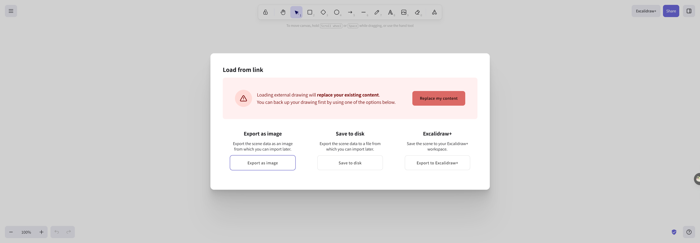

# recall-memory-hermes

**讓 Hermes Agent 擁有長期記憶。**

裝了這個 plugin 之後，Hermes 會自動記住你聊過的內容——即使你關掉對話重開、或開啟新對話，它也能回想起相關的歷史，讓 AI 不只有「當下看到的上下文」，還有「你們之前聊過什麼」。

---

## 快速安裝（2 分鐘）

### 你需要先準備

| 項目 | 說明 |
|------|------|
| **Hermes Agent** | 已安裝並正常運作。如果你是 Desktop 使用者，打開 Hermes 桌面端就行。 |
| **Python 3.10+** | 安裝 Hermes 時通常已經裝了。需要 `pip` 指令可用。 |
| **LM Studio（選項一）** 或 **任何 OpenAI 相容的 Embedding API** | 用來把文字轉成向量，讓 Hermes 能找到「意思相近」的歷史內容。如果不確定，先裝 LM Studio、啟動後載入一個 embedding 模型（例如 `nomic-ai/nomic-embed-text-v1.5`），並確認 `http://127.0.0.1:1234` 有回應。 |

### 安裝步驟

打開終端機（Terminal / 命令提示字元），依序執行：

```bash
# 1. 安裝底層記憶引擎
pip install recall-sqlite

# 2. 安裝這個 Hermes plugin
hermes plugins install Jnocode/recall-memory-hermes --enable

# 3. 啟用為記憶提供者
hermes memory setup recall-memory-hermes

# 4. 重新啟動 Hermes 讓設定生效
hermes gateway restart
```

> ⚠️ **重新啟動對話不會消失。** `hermes gateway restart` 只是重啟 Hermes 的背景服務，你的聊天記錄和設定都會保留。

---

## 設定

安裝後，編輯 `~/.hermes/config.yaml`（如果檔案不存在就建立它），加入以下設定：

```yaml
memory:
  provider: recall-memory-hermes
  recall-memory-hermes:
    db_path: "~/.hermes/recall.db"           # 記憶存放位置（預設會自動偵測）
    embed_url: "http://127.0.0.1:1234"       # Embedding 服務位置（預設 LM Studio）
    fallback_honcho: false                    # 如果找不到記憶，是否要查 Honcho 備援
    fallback_honcho_url: "http://localhost:8082"
```

### 設定說明

- **`embed_url`**：這是最關鍵的設定。Plugin 需要一個 Embedding API 來把文字轉成「語意向量」。如果你用 LM Studio，保持預設的 `http://127.0.0.1:1234` 即可。如果你用其他服務（如 OpenAI），改成對應的 URL。
- **`db_path`**：記憶資料庫存檔位置。不填的話會自動放在 Hermes 的資料目錄下。
- **`fallback_honcho`**：進階功能。當記憶搜尋不到足夠結果時，是否要到 Honcho（另一個記憶系統）查詢。

---

## 怎麼知道裝好了？

開一個新的 Hermes 對話，隨便聊幾句，然後關掉對話、再開一個新的問「我剛才說了什麼？」——如果 Hermes 能回答你之前的內容，就代表安裝成功。

---

## 技術架構



### 運作流程

1. **查詢路由**：使用者提問後，系統同時發送給向量檢索和全文檢索
2. **向量檢索（sqlite-vec）**：768 維 nomic-embed-text 嵌入，理解語意相似性
3. **全文檢索（FTS5）**：精準匹配關鍵字，補充向量檢索的盲點
4. **RRF 排序融合**：將兩路結果加權合併，取排名最前面的記憶
5. **三層快取**：
   - **Hot（常用）**：最近頻繁存取的記憶，最快回傳
   - **Warm（近期）**：一般記憶，平衡速度與儲存
   - **Cold（歸檔）**：歷史記憶，壓縮存放
6. **回傳結果**：80ms 內完成查詢

### 三層設計

| 層級 | 用途 | 技術 |
|------|------|------|
| 主要檢索 | 語意搜尋 | sqlite-vec（向量資料庫） |
| 備援層 | 不足時補充 | Honcho / pgvector HNSW（選用） |
| 快取層 | 加速本地查詢 | SQLite FTS5（全文檢索） |

> 大部分使用者只需要關心第一層——裝好 LM Studio 就會自動運作。

---

## 開發者專區

如果你想修改程式碼或貢獻：

```bash
git clone https://github.com/Jnocode/recall-memory-hermes.git
cd recall-memory-hermes
pip install -e .
hermes plugins install .
```
